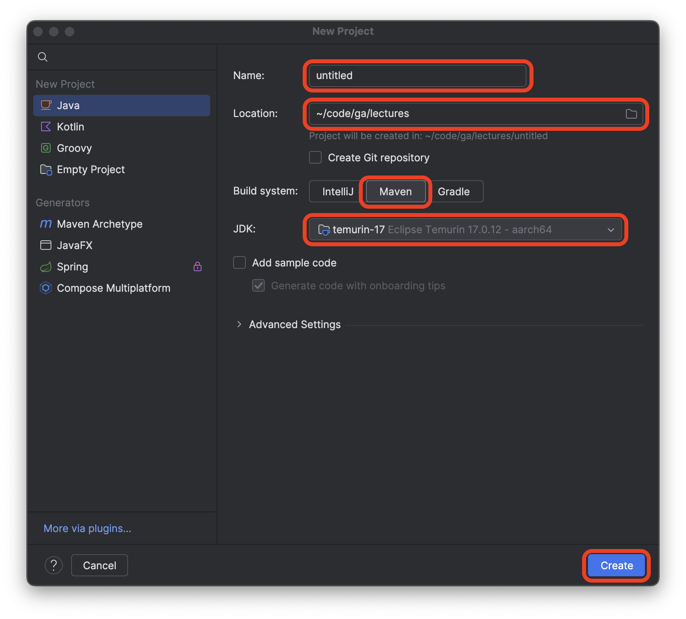
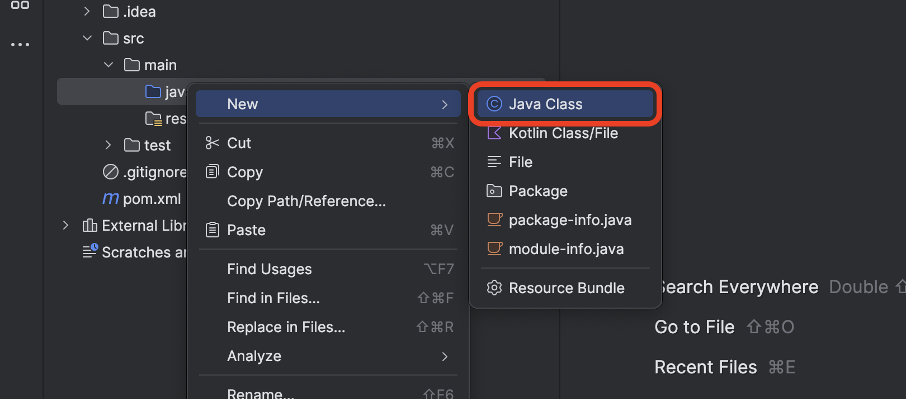
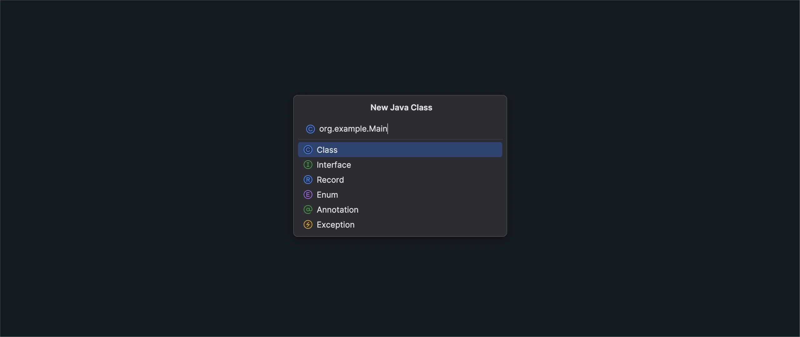
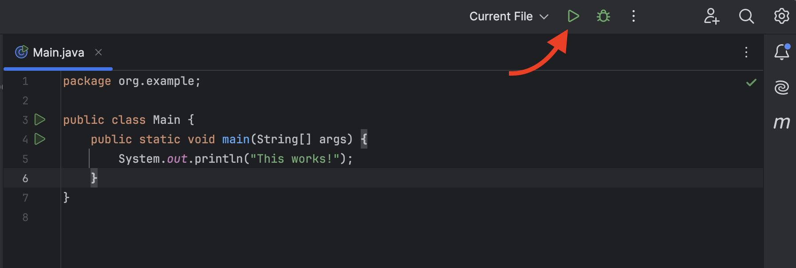

<h1>
  <span class="headline">The Heap and Garbage Collection in Java</span>
  <span class="subhead">Setup</span>
</h1>

## Setup

Launch the IntelliJ IDEA application.

Select the **New Project** option.

Name the project `the-heap-and-garbage-collection-in-java`.

Create the project in the <code class="filepath">~/code/ga/lectures</code> directory.

> ⚠️ Windows users, the <code class="filepath">lectures</code> directory is likely at this location on your device: <code class="filepath">C:\Users\username\code\ga\lectures</code> (replacing `username` with your username). Create the project in that directory instead.

Choose the **Maven** build system option.

Ensure the JDK used is **temurin-17**. This should be the default setting when starting a new project. If it's not, alert your instructor.

Ensure that the **Add sample code** option is not checked.

After confirming that the **New Project** window looks similar to the screenshot below, select the **Create** button. The name of the project should be `the-heap-and-garbage-collection-in-java`, not `untitled`.



Right-click on the <code class="filepath">src/main/java</code> directory and select **New** > **Java Class**, as shown in the screenshot below:



Name your new class `org.example.Main` as shown below.



When your **New Java Class** prompt looks like the above, select the **Class** option from the list. You should be taken to the new <code class="filepath">Main.java</code> file.

Add the required `main()` method inside of the `Main` class, including a print statement to confirm our setup worked:

```java
    public static void main(String[] args) {
        System.out.println("This works!");
    }
```

Run this file now to test that our setup worked. Use the green play button in the top bar, or use <kbd>Ctrl</kbd> + <kbd>R</kbd>.



A **Run** panel will appear at the bottom of the window, and you should see a message: `This works!`

We can get to work now that our project is set up.
